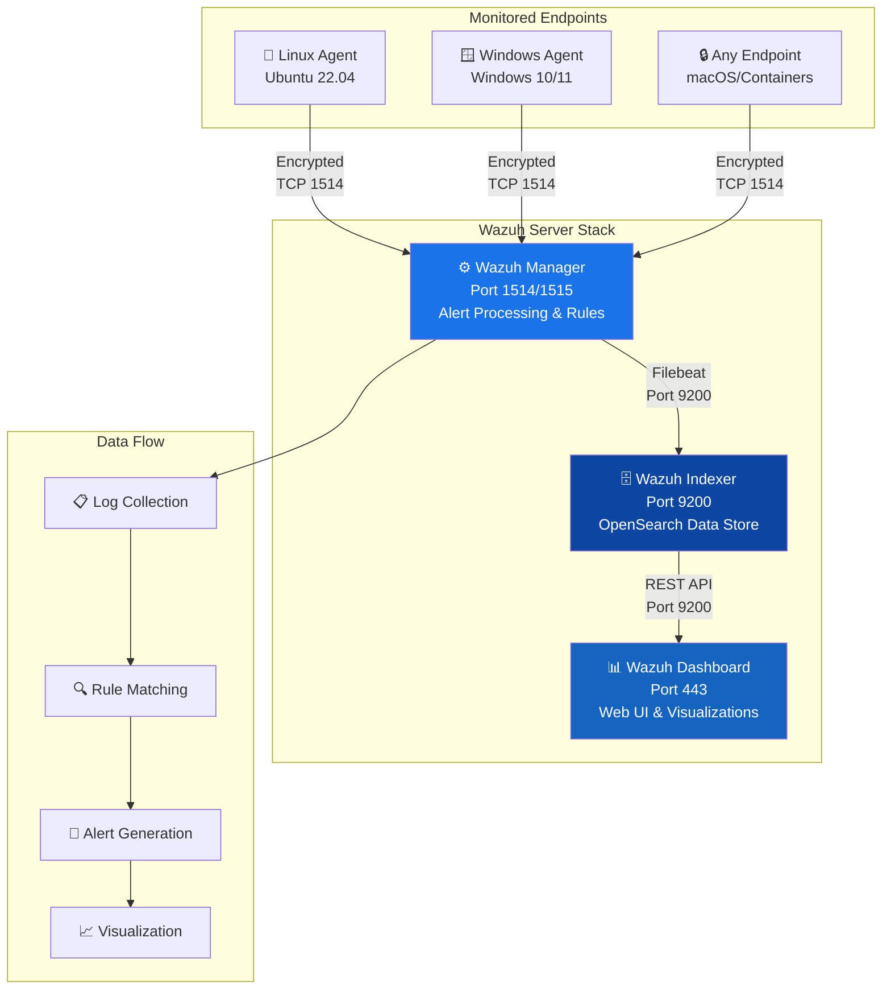
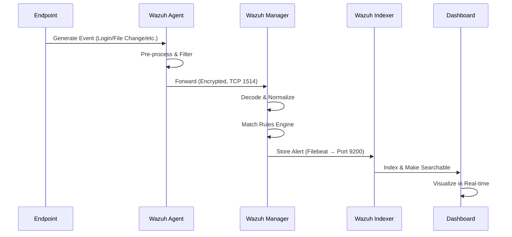

# 🛡️ Wazuh SIEM Installation & Agent Setup

<div align="center">


**A complete hands-on SIEM deployment project covering Wazuh installation, agent management, log collection, and dashboard navigation — built for students, SOC analysts, and cybersecurity portfolios.**

[📖 Docs](#-documentation) · [🚀 Quick Start](#-quick-start) · [🏗️ Architecture](#️-architecture) · [📊 Results](#-results--findings) · [🎯 Skills](#-skills-demonstrated)

</div>

---

## 📋 Table of Contents

- [Project Overview](#-project-overview)
- [Objectives](#-objectives)
- [Technologies Used](#️-technologies-used)
- [Architecture](#️-architecture)
- [Folder Structure](#-folder-structure)
- [Prerequisites](#-prerequisites)
- [Quick Start](#-quick-start)
- [Installation](#-installation)
- [Configuration](#️-configuration)
- [Step-by-Step Setup](#-step-by-step-setup)
- [Screenshots](#-screenshots)
- [Verification Steps](#-verification-steps)
- [Results & Findings](#-results--findings)
- [Troubleshooting](#-troubleshooting)
- [Lessons Learned](#-lessons-learned)
- [Security Concepts Learned](#-security-concepts-learned)
- [Skills Demonstrated](#-skills-demonstrated)
- [Future Improvements](#-future-improvements)
- [References](#-references)
- [Author](#-author)

---

## 🔍 Project Overview

This project documents the **end-to-end deployment of Wazuh**, an open-source Security Information and Event Management (SIEM) platform, in a home lab environment. It covers the complete lifecycle from installation to generating and analyzing first security alerts.

> **Why Wazuh?** Wazuh is used by enterprises worldwide as a production SIEM. Learning it demonstrates real-world SOC tooling knowledge — the same skills used by security analysts at organizations from startups to Fortune 500 companies.

### What This Project Covers

| Area | Description |
|------|-------------|
| 🖥️ **SIEM Deployment** | Wazuh Manager + Indexer + Dashboard on Ubuntu Server |
| 🤖 **Agent Management** | Linux & Windows agent enrollment and management |
| 📊 **Log Collection** | System logs, authentication events, file integrity |
| 🚨 **Alert Generation** | Trigger and analyze first security alerts |
| 📈 **Dashboard Navigation** | Explore Wazuh's security dashboard and modules |
| 📁 **Documentation** | Professional security documentation suitable for portfolio |

---

## 🎯 Objectives

- [x] Deploy Wazuh Manager, Indexer, and Dashboard using the official installation script
- [x] Enroll a Linux agent and verify communication with the manager
- [x] Enroll a Windows agent and collect Windows Event Logs
- [x] Configure File Integrity Monitoring (FIM) on critical directories
- [x] Trigger and analyze SSH brute-force detection alerts
- [x] Navigate the Wazuh dashboard and explore security modules
- [x] Document the complete process with screenshots and explanations
- [x] Identify and document common errors and their resolutions

---

## 🛠️ Technologies Used

| Technology | Version | Purpose |
|------------|---------|---------|
| **Wazuh Manager** | 4.7.x | Central SIEM server — processes alerts and manages agents |
| **Wazuh Indexer** | 4.7.x | OpenSearch-based data store for log indexing |
| **Wazuh Dashboard** | 4.7.x | Web-based UI for visualization and analysis |
| **Wazuh Agent** | 4.7.x | Lightweight sensor deployed on monitored endpoints |
| **Ubuntu Server** | 22.04 LTS | Host OS for Wazuh server components |
| **Windows 10/11** | — | Endpoint for Windows agent testing |
| **OpenSearch** | Bundled | Full-text search and analytics engine |
| **Filebeat** | Bundled | Log shipper for forwarding logs to indexer |

---

## 🏗️ Architecture

### System Architecture



### Alert Processing Flow



---

## 📁 Folder Structure

```
wazuh-siem-project/
│
├── 📄 README.md                    # This file — project overview and guide
│
├── 📂 docs/                        # Detailed documentation files
│   ├── 01-introduction.md          # Project introduction and background
│   ├── 02-architecture.md          # Detailed architecture explanation
│   ├── 03-installation.md          # Step-by-step installation guide
│   ├── 04-configuration.md         # Configuration reference
│   ├── 05-usage.md                 # How to use the dashboard
│   ├── 06-testing.md               # Testing and validation procedures
│   ├── 07-troubleshooting.md       # Common errors and fixes
│   ├── 08-faq.md                   # Frequently asked questions
│   ├── 09-references.md            # External references and resources
│   ├── 10-security-notes.md        # Security hardening notes
│   └── 11-lessons-learned.md       # Key takeaways and reflections
│
├── 📂 screenshots/                 # Visual evidence of the project
│   ├── 01-wazuh-dashboard.png      # Dashboard overview
│   ├── 02-agent-enrolled.png       # Agent enrollment confirmation
│   ├── 03-first-alert.png          # First security alert generated
│   ├── 04-fim-alert.png            # File Integrity Monitoring alert
│   └── 05-security-events.png      # Security events module
│
├── 📂 configs/                     # Configuration files used in this project
│   ├── ossec.conf                  # Wazuh Manager main config
│   ├── agent-linux.conf            # Linux agent configuration
│   ├── agent-windows.xml           # Windows agent configuration
│   └── fim-custom-rules.conf       # Custom FIM rules
│
├── 📂 scripts/                     # Automation and utility scripts
│   ├── install-wazuh.sh            # Automated Wazuh installation script
│   ├── enroll-agent.sh             # Agent enrollment helper
│   ├── test-alerts.sh              # Script to trigger test alerts
│   └── health-check.sh             # Check Wazuh component health
│
├── 📂 reports/                     # Security reports and analysis
│   └── wazuh-security-report.md    # Full professional security report
│
├── 📂 diagrams/                    # Architecture and flow diagrams
│   ├── architecture.png            # System architecture diagram
│   └── data-flow.png               # Data flow diagram
│
├── 📂 logs/                        # Sample log outputs (sanitized)
│   ├── sample-alerts.json          # Sample alert JSON output
│   └── agent-status.txt            # Sample agent status output
│
├── 📂 references/                  # External resources and reading material
│   └── reading-list.md             # Curated reading list
│
└── 📄 LICENSE                      # MIT License
```

---

## ✅ Prerequisites

### Hardware Requirements

| Component | Minimum | Recommended |
|-----------|---------|-------------|
| **RAM** | 4 GB | 8 GB |
| **CPU** | 2 cores | 4 cores |
| **Storage** | 50 GB | 100 GB |
| **Network** | 1 interface | 1+ interfaces |

### Software Requirements

- Ubuntu Server 22.04 LTS (for Wazuh server)
- Root or sudo access
- Internet connectivity (for package downloads)
- A second machine or VM for agent testing (optional but recommended)

### Knowledge Prerequisites

| Topic | Level Needed |
|-------|-------------|
| Linux command line | Basic |
| Networking basics (TCP/IP) | Basic |
| What a SIEM is | Conceptual |
| Log analysis | None required |

---

## 🚀 Quick Start

> ⚠️ **Run as root or with sudo on Ubuntu 22.04 LTS**

```bash
# Step 1: Download the Wazuh installation assistant
curl -sO https://packages.wazuh.com/4.7/wazuh-install.sh

# Step 2: Make it executable
chmod +x wazuh-install.sh

# Step 3: Run the all-in-one installation
sudo bash wazuh-install.sh -a

# Step 4: Note the credentials printed at the end — save them!
# Access the dashboard at: https://<YOUR-IP>
```

For the complete guide, see [docs/03-installation.md](docs/03-installation.md).

---

## 💾 Installation

See the [complete installation guide](docs/03-installation.md) for detailed steps. Here is the high-level process:

### Phase 1: Prepare the System

```bash
# Update the system
sudo apt-get update && sudo apt-get upgrade -y

# Set the hostname (optional but recommended)
sudo hostnamectl set-hostname wazuh-server

# Disable swap (recommended for Wazuh Indexer)
sudo swapoff -a
sudo sed -i '/ swap / s/^\(.*\)$/#\1/g' /etc/fstab
```

### Phase 2: Install Wazuh (All-in-One)

```bash
# Download the installer
curl -sO https://packages.wazuh.com/4.7/wazuh-install.sh

# Install all components
sudo bash wazuh-install.sh -a

# The installer will output credentials like:
# INFO: --- Summary ---
# INFO: You can access the web interface https://<wazuh-dashboard-ip>
#    User: admin
#    Password: <RANDOM_PASSWORD>
```

### Phase 3: Enroll a Linux Agent

```bash
# On the AGENT machine, add the Wazuh repository
curl -s https://packages.wazuh.com/key/GPG-KEY-WAZUH | gpg --no-default-keyring \
  --keyring gnupg-ring:/usr/share/keyrings/wazuh.gpg --import
chmod 644 /usr/share/keyrings/wazuh.gpg

echo "deb [signed-by=/usr/share/keyrings/wazuh.gpg] \
  https://packages.wazuh.com/4.x/apt/ stable main" | \
  tee /etc/apt/sources.list.d/wazuh.list

# Install the agent
WAZUH_MANAGER="<YOUR-MANAGER-IP>" apt-get install wazuh-agent

# Start the agent
sudo systemctl daemon-reload
sudo systemctl enable wazuh-agent
sudo systemctl start wazuh-agent
```

---

## ⚙️ Configuration

### Wazuh Manager Configuration (`/var/ossec/etc/ossec.conf`)

```xml
<ossec_config>
  <!-- Global configuration -->
  <global>
    <jsonout_output>yes</jsonout_output>
    <alerts_log>yes</alerts_log>
    <logall>no</logall>
    <logall_json>no</logall_json>
    <email_notification>no</email_notification>
  </global>

  <!-- File Integrity Monitoring -->
  <syscheck>
    <frequency>300</frequency>
    <directories check_all="yes">/etc,/usr/bin,/usr/sbin</directories>
    <directories check_all="yes">/bin,/sbin,/boot</directories>
    <ignore>/etc/mtab</ignore>
    <ignore>/etc/hosts.deny</ignore>
  </syscheck>

  <!-- Log analysis -->
  <localfile>
    <log_format>syslog</log_format>
    <location>/var/log/auth.log</location>
  </localfile>
</ossec_config>
```

### Agent Configuration for Linux (`/var/ossec/etc/ossec.conf`)

```xml
<ossec_config>
  <client>
    <server>
      <address>YOUR_MANAGER_IP</address>
      <port>1514</port>
      <protocol>tcp</protocol>
    </server>
  </client>

  <syscheck>
    <frequency>300</frequency>
    <directories>/home,/tmp,/var/log</directories>
  </syscheck>
</ossec_config>
```

---

## 📸 Screenshots

> Screenshots are stored in the [`screenshots/`](screenshots/) directory.

| # | Description | File |
|---|-------------|------|
| 1 | Wazuh Dashboard — Main Overview | [screenshots/01-wazuh-dashboard.png](screenshots/01-wazuh-dashboard.png) |
| 2 | Agent Enrolled and Active | [screenshots/02-agent-enrolled.png](screenshots/02-agent-enrolled.png) |
| 3 | First Security Alert Generated | [screenshots/03-first-alert.png](screenshots/03-first-alert.png) |
| 4 | File Integrity Monitoring Alert | [screenshots/04-fim-alert.png](screenshots/04-fim-alert.png) |
| 5 | Security Events Module | [screenshots/05-security-events.png](screenshots/05-security-events.png) |

---

## ✔️ Verification Steps

After installation, verify everything is working:

```bash
# 1. Check all Wazuh services are running
sudo systemctl status wazuh-manager wazuh-indexer wazuh-dashboard

# 2. Verify agents are connected
sudo /var/ossec/bin/agent_control -l

# Expected output:
# Wazuh agent_control. List of available agents:
#    ID: 000, Name: wazuh-server (server), IP: 127.0.0.1, Active/Local
#    ID: 001, Name: linux-agent, IP: 192.168.1.x, Active

# 3. Check alerts are being generated
sudo tail -f /var/ossec/logs/alerts/alerts.json

# 4. Verify the indexer has data
curl -k -u admin:PASSWORD https://localhost:9200/_cat/indices | grep wazuh

# 5. Access the dashboard
# Open browser: https://<YOUR-IP>
# Login: admin / <password from installation>
```

---

## 📊 Results & Findings

### Alerts Generated During Testing

| Alert ID | Rule | Level | Description |
|----------|------|-------|-------------|
| 5710 | SSH Auth Failure | 5 | Multiple failed SSH login attempts detected |
| 554 | File Modified | 7 | Critical file `/etc/passwd` modification detected |
| 510 | New File Created | 3 | New file added to monitored directory |
| 5501 | User Login | 3 | Successful user login via SSH |
| 40101 | Sudo Usage | 5 | Sudo command executed by user |

### Agent Status Summary

```
Total Agents: 2
  Active:      2
  Disconnected: 0
  Never Connected: 0
```

---

## 🔧 Troubleshooting

| Problem | Symptom | Solution |
|---------|---------|----------|
| Agent not connecting | "Never Connected" in dashboard | Check firewall — open port 1514/TCP |
| Dashboard not loading | HTTPS timeout | Run `systemctl restart wazuh-dashboard` |
| Indexer down | No data in dashboard | Check RAM — Indexer needs 4GB+ |
| No alerts showing | Dashboard empty | Wait 5 min after agent connects |
| GPG key error | `apt-get` fails | Re-run the GPG key import command |

For detailed troubleshooting, see [docs/07-troubleshooting.md](docs/07-troubleshooting.md).

---

## 💡 Lessons Learned

1. **Resource Planning Matters** — The Wazuh Indexer is memory-hungry. Allocating less than 4GB RAM causes crashes. Always provision properly.
2. **Firewall is Usually the Culprit** — Most agent connectivity issues come down to port 1514 being blocked. Always check the firewall first.
3. **Log Volume is Real** — Even a minimal lab with 2 agents generates hundreds of events per hour. This taught me the importance of tuning and suppression rules.
4. **Rule Hierarchy** — Wazuh's rule system is hierarchical. Understanding parent/child rule relationships is key to writing effective custom detection rules.
5. **Documentation is a Security Tool** — Keeping records of baseline configuration helps detect drift later.

---

## 🔐 Security Concepts Learned

| Concept | How It Was Applied |
|---------|-------------------|
| **CIA Triad** | Understood how SIEM protects Confidentiality, Integrity, and Availability |
| **Defense in Depth** | SIEM is one layer in a multi-layered security architecture |
| **Least Privilege** | Wazuh agent runs with minimal permissions needed |
| **Log Management** | Centralized log collection from multiple endpoints |
| **Anomaly Detection** | Rule-based detection of unusual patterns |
| **File Integrity Monitoring** | Detecting unauthorized changes to critical files |
| **Incident Response** | Using alerts as inputs to an IR workflow |
| **MITRE ATT&CK** | Wazuh maps alerts to ATT&CK techniques |
| **Threat Hunting** | Using the dashboard to proactively search for threats |

---

## 🎯 Skills Demonstrated

```
Security Operations ████████████████████ 95%
SIEM Administration  ████████████████░░░░ 80%
Log Analysis         ████████████████░░░░ 80%
Linux Administration ███████████████████░ 90%
Documentation        ████████████████████ 95%
Network Security     █████████████░░░░░░░ 65%
Threat Detection     ██████████████░░░░░░ 70%
```

**Technical Skills:**
- Deploying enterprise-grade SIEM in a lab environment
- Configuring and enrolling security agents across different OS types
- Writing and customizing detection rules
- Analyzing JSON-formatted security alerts
- Navigating and using SOC dashboards
- File Integrity Monitoring (FIM) configuration

**Soft Skills:**
- Technical documentation writing
- Systematic troubleshooting approach
- Security-first thinking

---

## 🚀 Future Improvements

- [ ] **Active Response** — Configure Wazuh to automatically block IPs that trigger brute-force alerts
- [ ] **Custom Rules** — Write custom detection rules for specific threat scenarios
- [ ] **MITRE ATT&CK Mapping** — Map all lab-generated alerts to ATT&CK techniques
- [ ] **TheHive Integration** — Connect Wazuh to TheHive for case management
- [ ] **Shuffle SOAR** — Automate alert enrichment and ticketing via Shuffle
- [ ] **Threat Intelligence** — Integrate VirusTotal and AlienVault OTX feeds
- [ ] **Vulnerability Scanner** — Enable Wazuh's built-in vulnerability detection
- [ ] **Docker Deployment** — Containerize the entire stack with Docker Compose
- [ ] **Cloud Deployment** — Deploy on AWS EC2 for 24/7 availability
- [ ] **Detection Engineering** — Build a custom rule detection pipeline

---

## 📚 References

| Resource | URL |
|----------|-----|
| Wazuh Official Documentation | https://documentation.wazuh.com |
| Wazuh Installation Guide | https://documentation.wazuh.com/current/installation-guide/ |
| Wazuh Rules Reference | https://documentation.wazuh.com/current/user-manual/ruleset/ |
| MITRE ATT&CK Framework | https://attack.mitre.org |
| NIST Cybersecurity Framework | https://www.nist.gov/cyberframework |
| OpenSearch Documentation | https://opensearch.org/docs/ |

---

## 👤 Author

<div align="center">

**Kshitiz**
*BSc (Hons) Computer Science | Ramanujan College, University of Delhi*
*Cybersecurity Enthusiast | CRTA Certified | Top 3% TryHackMe*

[](https://linkedin.com/in/YOUR-PROFILE)
[](https://tryhackme.com/p/YOUR-PROFILE)
[](https://github.com/YOUR-USERNAME)

</div>

---

<div align="center">

⭐ **If this project helped you, please star the repository!** ⭐

*Made with 🛡️ for the cybersecurity community*

</div>
